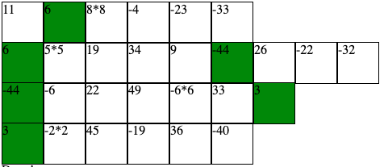
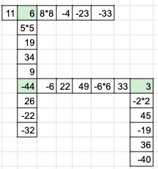
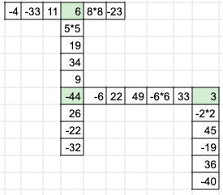

### Using the (partially-completed) Squared2 puzzle generator

- Go to [https://staktrace.github.io/squared2/index.html](https://staktrace.github.io/squared2/index.html).
- Click on the `Generate puzzle` button.
- Wait until it's done. (If it gives you an error, click on the `Generate puzzle` button to try again).

The generator will generate some rows of boxes.
Each row is a line of the puzzle.
The green squares represent intersection points between lines.

So the first line and second line will intersect at the green square that is common between the first two rows of the generated puzzle.
This means that in the final puzzle representation, the second line will be oriented perpendicular to the first (so if the first line is placed horizontally, the second must be vertical).
Each consecutive pair of rows should have one matching green square.
This allows the lines of the puzzle to be arranged in alternating orientations to construct the puzzle.

The pictures below illustrate taking the output of the generator and placing it in a grid.

converts to

which can then be further rearranged as needed while maintaining the intersection points.
For example, the above grid can be converted to the one below by rearranging the numbers in the top line:

Notice that to the left of the `Generate puzzle` button are two number boxes (they are set to "21" and "3" initially).
These numbers follow the pattern in the Squared2 booklet, where the first number is target that each line adds up to, and the second is the number of intersections in the puzzle.

- Try adjusting the numbers up and down and generating puzzles. Be aware that making the numbers too big or too small may result in being unable to generate puzzles successfully, but feel free to experiment.
