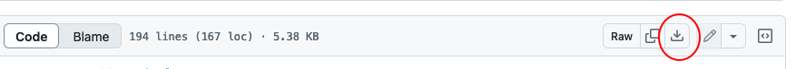
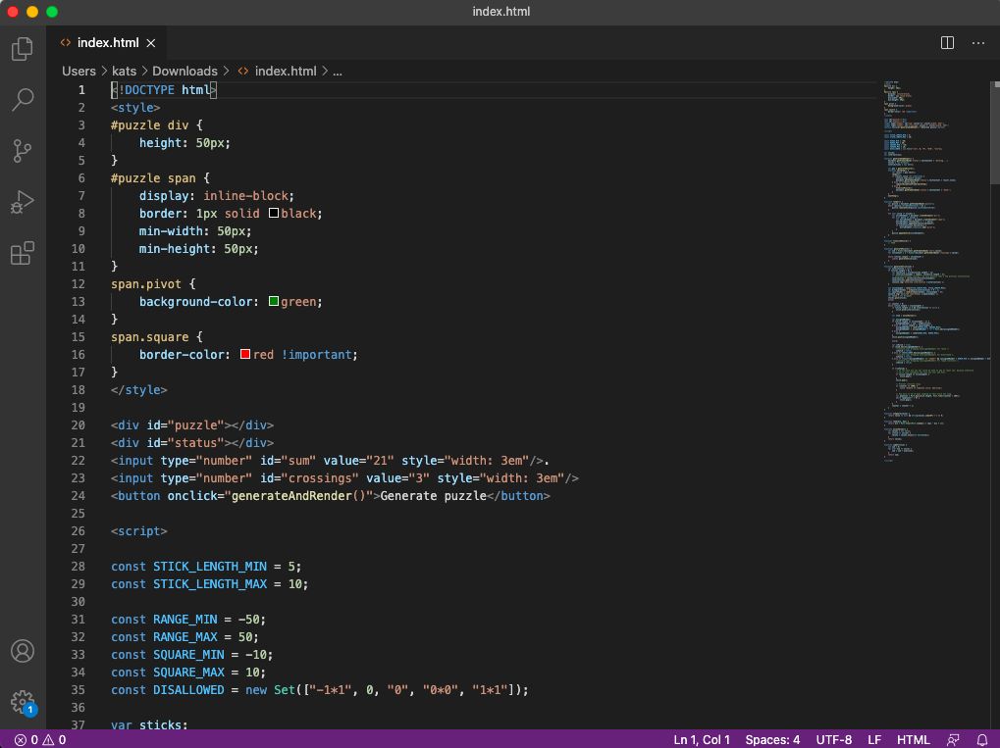

### Downloading the code and running a local copy

The puzzle generator at https://staktrace.github.io/squared2/index.html is hosted online, but it's a webpage you can copy and run on your computer.
That way, you can make changes to it and experiment with it.

- Go to [https://github.com/staktrace/squared2/blob/main/index.html](https://github.com/staktrace/squared2/blob/main/index.html).
  This will show you the code for the generator (the "source code" for the webpage, in this case).
- On that page, click on the "Download raw file" link as shown, and save the file to your Downloads folder (or somewhere else easy to find).
  The file should be called `index.html`.

- Open the Finder (blue smiley face icon at the bottom of the screen) and navigate to where you saved the file.
- Double-click on the file - this should open it in your web browser (Firefox/Chrome/Safari/etc.).
  The URL should start with `file:///`, but otherwise should look and work exactly as the original version.

### Using a code editor

The next step is to modify the source code to make a change to your local copy of the puzzle generator.
In order to do this we are going to use a simple code editor called Visual Studio Code.

- Go to [https://code.visualstudio.com/](https://code.visualstudio.com/), download, and intall it.
- From within Visual Studio Code, you can go to `File` -> `Open...` and select the `index.html` file that you downloaded.
  You should now see a code window that looks something like this:

The exact colours and layout may be a bit different but you should see lines of code starting with `<!DOCTYPE html>` on the first line.

### Making a small change

- Now go to line 19, between the `</style>` and the `

` lines.
- Here, type in this line: `<h1>Squared2 puzzle generator</h1>`.
  The code editor might help you with putting in the `</h1>` at the end as you are doing this, that's fine.
- Now save the changes with `File` -> `Save`, and open the `index.html` file in your web browser again (if you still have it open, you can hit the Reload button).
  You should see a big title show up at the top of the page.

Congratulations, you have made your first small change!
