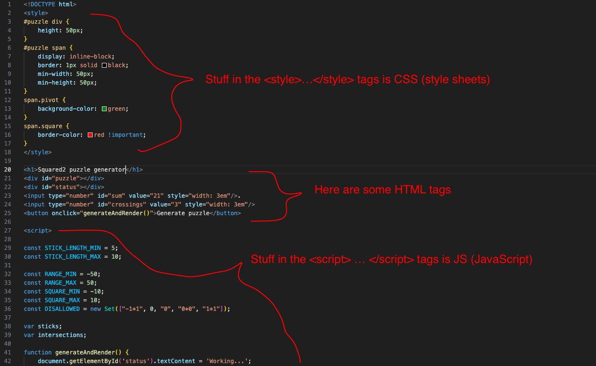

### Experimenting with CSS

Modern webpages generally have three main components: HTML (HyperText Markup Language), CSS (Cascading Style Sheets), and JS (JavaScript).

You can think of the HTML as the "skeleton", it sets up the basic structure (bones) of the page.
The CSS is used to modify the appearance of the skeleton (putting on flesh, skin, clothes, etc.).
And the JS brings it to life, giving it the ability to move and change itself.

The puzzle generator webpage we have has all three components, as indicated in the screenshot below.



The things that start and end with `<>` angle brackets are HTML "tags", so we say `<style>` is a style tag and `<h1>` is a h1 tag.
The tag is "closed" by the corresponding tag with a `/` in front of the name, like `</style>` and `</h1>`.
In this webpage, the CSS and JS sit inside `<style>` and `<script>` tags respectively, but they could also be put into separate files if that's more convenient.

Anyway, in this exercise we're going to play a little bit with the CSS.

### Styling your H1

In the last exercise, you added an `h1` tag (h1 stands for "heading 1").
In this exercise, we're going to add some CSS and play around with it to see what we can do with it.

To start, go to line 18, where the `</style>` tag is.
Just above that, insert this:

```css
h1 {
  color: green;
}
```

Then save the code and reload the page in your web browser.
As you might expect, this changes your heading to be green instead of black.

The general structure of CSS is like this:

```css
selector {
  property: value;
  property: value;
  ...
}
```

In the example above, the selector is `h1`, which will match all the `<h1>` tags on the page.
And we just have one property, `color` with the value set to `green`.

### Other properties

For now we're just going to explore some different properties and values to get a sense of what can be done with CSS.
There are a lot of different properties and web browsers are adding support for more properties all the time.
[This page](https://www.w3schools.com/cssref/index.php) has a big list of them, but here are a few simple but interesting ones.
Add these inside the `h1 { ... }` CSS block and see what they do.

- `font-size: 100px;`
- `background-image: linear-gradient(red, blue);
- `transform: rotate(30deg);`
- `transform-origin: top left;`

Feel free to experiment with different values and scroll through the [big list](https://www.w3schools.com/cssref/index.php) to see if any sound interesting and try them out.
Your code editor should also help you discover things as you're typing, so keep an eye on the auto-complete popups.
