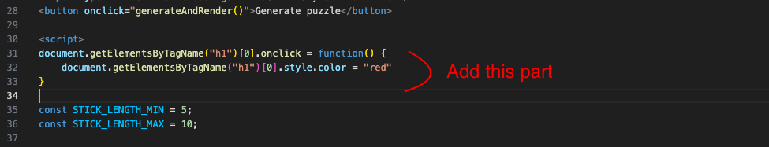
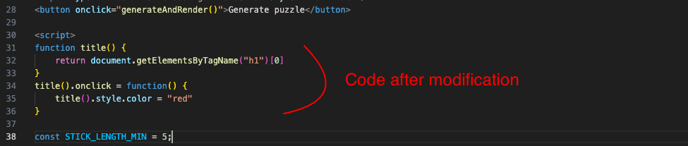

### Experimenting with JavaScript

In this exercise we're going to start adding some JS to get a sense of how it works.

Recall from the last exercise that the HTML is the skeleton, the CSS puts clothes on it, and JS brings it to life.
We saw how we had an `<h1>` HTML tag, and then could change how it looked by changing the CSS.
Now we're going to use a small bit of JS to change it based on user actions.

### Click to color

Go to the script start tag, which looks like `<script>` (on line 26 of the original file, but may be different if you kept your changes to the file).
Just below that, add this:

```
document.getElementsByTagName("h1")[0].onclick = function() {
    document.getElementsByTagName("h1")[0].style.color = "red"
}
```

It should look like this:


Save the page and reload it in the web browser.
Now, click on the title of the page (where it says "Squared2 puzzle generator").
The JS code you added should make it turn red.

We're going to examine the JS in more detail now to understand exactly what's going on.
It's just two lines of code but there's a lot going on and we'll unpack it bit by bit.

- The very first bit is `document`. `document` is a reference to the HTML document, and is something that is built in to JS.
  You can just use `document` from any JS code to refer to the HTML document.
- The next bit is `.getElementsByTagName("h1")`. This is calling a function on the `document` object called `getElementsByTagName`.
  A "function" is a bit of code that can be reused - functions normally take some kind of input and produce some kind of output. In this
  case, the `getElementsByTagName` function takes as input a "tag name", and outputs a list of HTML elements that match the tag name.
  So when we write `document.getElementByTagName("h1")`, we're telling the `getElementsByTagName` function to give us all the
  `<h1>` elements in the `document`. You can read more about `getElementsByTagName` [here](https://developer.mozilla.org/en-US/docs/Web/API/Document/getElementsByTagName).
- The next bit is `[0]`. The previous bullet described how `getElementsByTagName` returns a **list** of elements. However, we know
  that the page only has one `<h1>` element, and we just want to deal with that one element. The `[0]` says "give me the item at
  position 0 in the list". Most programming languages, including JS, use zero-based numbering, so what you think of as the "first" item
  in the list is usually at position 0. So doing `[0]` gets the first item in the list of `<h1>` elements. If you did `[1]` you'd get
  the second `<h1>` (if there was one, but in this case there isn't so you'd just get a `null` object back).
- The next bit is `.onclick = function() { ... }`. The `=` here is not an equality operation like in Math. It is actually an
  assignment operation. It takes the thing on the right side of the `=` and puts it at whatever is on the left side. So in
  this case what is happening is the `function() { ... }` stuff is getting assigned to the `onclick` property of the `<h1>` element
  that we got from `document.getElementsByTagName("h1")[0]`. The `onclick` property is again something that is already built in to
  language, and assigning a function to it means the web browser will call that function when the target is clicked. The target
  in this case is the `<h1>` element.
- The last bit of interest is the "body" of the function assigned to the `onclick` property. The function body is the part inside the
  curly braces `{}`, and in this case it is `document.getElementsByTagName("h1")[0].style.color = "red"`. Recall from the second
  bullet that functions are bits of reusable code. The body of the function is the part that gets reused, and in this case the body
  will get run every time somebody clicks on the `<h1>` element. The first part of the function body should already be familiar -
  the `document.getElementsByTagName("h1")[0]` gets the first `<h1>` element in the HTML document. The new part here is `.style.color = "red"`
  and that should be somewhat familiar from the previous exercise on CSS. What this is doing is setting the CSS `color` property
  to `red`. And that's why the title turns red when you click on it.

### Refactoring

Now that you have a sense of what the code is doing, we're going to try and simplify it a little bit.
In particular, there are two copies of the phrase `document.getElementsByTagName("h1")[0]` and it's a lot to type out.

Recall from above that functions are bits of reusable code, so what we'll do is create a function that does this so we don't have to type it out every time.

Go back to the JS code and modify it to look like this:



What we're doing here is introducing a new function to help us reuse code a bit.
It doesn't take any inputs, but it produces one output, which is the the first `<h1>` element in the HTML document.
The function is called `title`, so now we can call `title()` and get that `<h1>` element instead of having to write out `document.getElementsByTagName("h1")[0]` everywhere.

The only other new thing here should be the word `return` in the function body, which is how you return an output from the function.
Saying `return something` in your `function title()` means that whoever is using function (by writing `title()`) gets back the `something` that was `return`ed.

This modified code does the exact same thing as the first version, so you should be able to save the changes, reload in the browser, and see the same effect when you click on the title.

### Exercise Challenge

Now for a challenge!

In the above exercise, we used the `onclick` property of the `<h1>` element to change the color.
However there are other properties, like `onmouseover` (which runs when you move the mouse over the element) and `onmouseout` (which runs when you move the mouse off the element).

Update the code so that instead of changing the color to red on clicking, it changes to red when the mouse is moved over the element, **and** changes it to blue when the mouse is moved off.
This means that moving your mouse around on the page should cause the title to alternate between red and blue.
